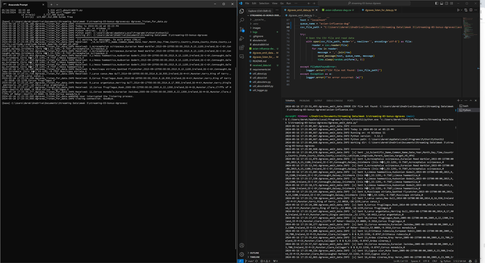

# streaming-03-bonus-dgraves

**Author**: Derek Graves
**Date**: May 16, 2024

This is a custom streaming project that uses RabbitMQ and a producer and consumer to read from a CSV file and write messages to a new queue every 1-3 seconds. 

This project requires some free code - beyond that available in the Python Standard Library.  The CSV file source used can be found in the references below. To avoid messing up our local default Python installation, and any other Python projects we may have, we create a local virtual environment to install and use these libraries.

## Prerequisites

1. Git
2. Python 3.7+ (3.11+ preferred)
3. VS Code Editor
4. VS Code Extension: Python (by Microsoft)
5. RabbitMQ Server installed and running locally

## Avian Influenza Dataset

"This dataset provides comprehensive insights into the distribution and potential spread of avian influenza, commonly known as "Bird Flu," in Ireland. Avian influenza is a highly contagious and often fatal viral disease primarily affecting birds, with wild migratory water birds being the main reservoir of the virus.

The dataset includes information about bird species captured in Ireland from 1980 to 2020, focusing on species targeted for the H5N1 strain of avian flu. Understanding the geographic distribution of these bird species is crucial for assessing the risk of avian influenza introduction into Ireland, especially during migratory seasons when wild birds arrive and congregate on wetlands, potentially mixing with resident species."

Link to dataset and description on Kaggle: (https://www.kaggle.com/datasets/jasmeet0516/bird-flu-dataset-avian-influenza)

## Task 1. Create a Python Virtual Environment

We will create a local Python virtual environment to isolate our project's third-party dependencies from other projects.

1. Open a terminal window in VS Code.
2. Use the built-in Python utility venv to create a new virtual environment named `.venv` in the current directory.

```shell
python -m venv .venv
```

Verify you get a new .venv directory in your project. 
We use .venv as the name to keep it away from our project files. 

## Task 2. Activate the Virtual Environment

In the same VS Code terminal window, activate the virtual environment.

- On Windows, run: 
```bash
source .venv\Scripts\activate
```

Verify you see the virtual environment name (.venv) in your terminal prompt.

NOTE: When activating the environment on a second console, do the following for the reccommended use of multiple terminals:

- The recommended way - with lots of space for your terminal -  is to jump out of VS Code and run your scripts outside VS Code. 

For each concurrent terminal or process, do the following:

- Open a new Anaconda Prompt (Windows) or Terminal (Mac) window. 
- Use the cd (change directory) commandLinks to an external site to cd to your repo folder. 
- Verify your scripts are here with the dir (or ls) command. You should see your .py files. 
- Activate or verify your Python environment:  conda activate base
- Start your script: python script.py (use the name of  your file)
 

Windows example:

- Project repo location: C:\Users\dgraves4\Documents\streaming-03-rabbitmq
- Anaconda prompt opens in (base) C:\Users\dgraves4>

```bash
cd Documents/streaming-03-rabbitmq
dir
conda activate base
.venv\Scripts\activate
```
## Task 3. Install Dependencies into the Virtual Environment

To work with RabbitMQ, we need to install the pika library.
A library is a collection of code that we can use in our own code.
Learning to use free libraries that others have written to make our projects easier, faster, more reliable is a key skill for a developer.

We keep the list of third-party libraries needed in a file named requirements.txt.
Use the pip utility to install the libraries listed in requirements.txt into our active virtual environment. 

Make sure you can see the .venv name in your terminal prompt before running this command.

`python -m pip install -r requirements.txt`

## Task 4. Verify Setup (OPTIONAL - ONLY WORK ON SOME CONFIGURATIONS)

In your VS Code terminal window, run the following commands to help verify your setup.
These util files MAY be helpful to ensure you're setup correctly. 
You may have a different configuration and RabbitMQ may still work; the check looks in common places, but may not work for all installations. 
They are meant to be helpful, but are not required.

You can help by updating the code for other common configurations. 
Just fork the current repo, add your change, and create a pull request (no other changes please) and I'll pull it back in. 

```bash
py util_about.py
py util_aboutenv.py
py util_aboutrabbit.py
pip list
```
## Task 5. Execute the Producer/Sender

There are some additional imports added to the file from the Standard Library:

```bash
# Import from Standard Library
import sys
import csv
import time
import random
```

There are also some specific elements added that make this file unique:

1. Script: dgraves_emit_data.py
2. Description: This script reads messages from a CSV file and sends them to a named queue every 1-3 seconds.
3. Changes: The script was modified to:
- Open and read a CSV file.
- Send each row of the CSV file as a message to the RabbitMQ queue.
- Pause for a random interval between 1 and 3 seconds between messages.

Now we are ready to execute: 

1. Read dgraves_emit_data.py
2. Run the file. 

It will run, emit a message to the named RabbitMQ queue, and finish. A logging file is also generated.
We can execute additional commands in the terminal as soon as it finishes. 

There are also some additional functions that have been added for opening and reading CSV files and sending them at 1-3 second intervals: 

```bash
# ---------------------------------------------------------------------------
# If this is the script we are running, then call some functions and execute code!
# ---------------------------------------------------------------------------
if __name__ == "__main__":
    host = "localhost"
    queue_name = "avian-influenza-dwg"
    csv_file_path = "C:\\Users\\derek\\OneDrive\\Documents\\Streaming Data\\Week 3\\streaming-03-bonus-dgraves\\avian-influenza.csv"

    try:
        # Open the CSV file and read data
        with open(csv_file_path, mode='r', newline='', encoding='utf-8') as file:
            reader = csv.reader(file)
            for row in reader:
                message = ','.join(row)
                send_message(host, queue_name, message)
                time.sleep(random.uniform(1, 3)) #Randomly generate a row message every 1-3 seconds

    except FileNotFoundError:
        logger.error(f"CSV file not found: {csv_file_path}") #Additional logging if CSV file path is not found
```

## Task 6. Execute the Consumer/Listener
1. Script: dgraves_listen_for_data.py
2. Description: This script continuously listens for messages on a named queue and writes them to a new file as they are received.
3. Changes: The script was modified to:
- Listen for messages on the same queue used by the producer.
- Write each received message to a new file named received_data.txt.

Now we are ready to: 

1. Read dgraves_listen_for_data.py 
2. Run the file.

## Task 7. Verify Messages Sent/Recieved in Terminals

If an error occurs during the execution of either file, review the terminal and generated log file for specifics.  Ensure that in your alternate terminal that you're in the correct directory and have the virtual environment activated. Otherwise, one termnal should be emitting data rows every 1-3 seconds, with the listener file receiving these rows in real time: 



## Sources
All files were build and modified from the original source files and code included in this course repository:
- [streaming-03-rabbitmq](https://github.com/denisecase/streaming-03-rabbitmq)

- CSV file used for this project: [Avian Influenza Dataset](https://www.kaggle.com/datasets/jasmeet0516/bird-flu-dataset-avian-influenza)
- [RabbitMQ Official Website](https://www.rabbitmq.com/)
- [pika Documentation](https://pika.readthedocs.io/)
- [Python 3.7+ Documentation](https://docs.python.org/3/)
- [Visual Studio Code](https://code.visualstudio.com/)
- [Python Extension for Visual Studio Code](https://marketplace.visualstudio.com/items?itemName=ms-python.python)

